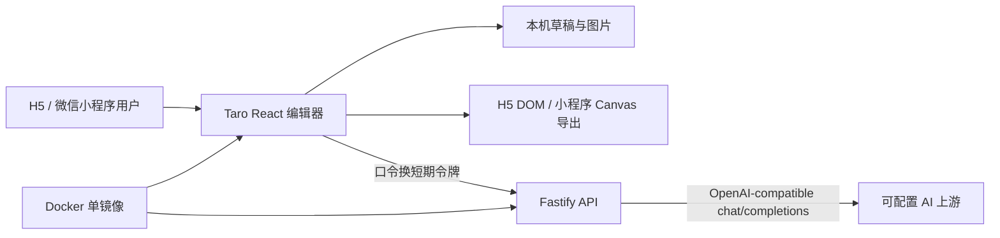

# 技术架构

## 1. 总览



前端与服务端共享 `packages/contracts`，避免 API 和本地草稿模型分叉。随机内容和数据变换由 `packages/editor-core` 提供。

## 2. Monorepo

仓库使用 pnpm workspace：

- `@wejizan/client`
- `@wejizan/server`
- `@wejizan/contracts`
- `@wejizan/editor-core`

根 `package.json` 负责聚合开发、类型检查、测试和构建。Node.js 版本范围为 24–26，包管理器固定为 pnpm 11.15.1。

## 3. 共享数据模型

`packages/contracts/src/index.ts` 使用 Zod 定义：

- `Identity`：昵称、程序化头像种子、可选自定义头像
- `LocalImage`：本地图片来源、尺寸和裁切元数据
- `MomentPost`：作者、文案、最多 9 张图片、最多 100 个点赞、最多 8 条评论
- `StatusBarScheme`：平台、前景/背景和可拖动状态组件
- `ScreenshotOverlay`：原图、互动块坐标/宽度和状态栏覆盖开关
- `EditorProject`：完整本地草稿，当前 `schemaVersion` 为 1
- AI 请求与响应 schema

修改模型时，以这里为唯一事实来源。当前没有 schema 迁移器，版本升级前必须先设计旧草稿迁移。

## 4. 前端

### 4.1 入口与配置

- `apps/client/config/index.ts`：Taro Webpack 5 配置、H5 代理和 workspace 源码编译。
- `apps/client/src/index.html`：H5 HTML 模板。
- `apps/client/src/pages/editor/index.tsx`：编辑器状态、表单、AI 和导出编排。
- `apps/client/src/pages/editor/index.scss`：编辑器与朋友圈视觉。

Taro 只默认编译客户端 `sourceRoot`。共享 TypeScript 源码通过 `compile.include` 加入 H5/小程序编译，并强制使用 `babel.config.cjs`。Webpack 固定为 5.91.0，以匹配 Taro runner 的插件约束。

### 4.2 组件

- `PhoneSimulator.tsx`：手机容器、朋友圈信息流、叠加模式和隐藏导出表面。
- `MomentPostCard.tsx`：朋友圈卡片与点赞/评论区。
- `StatusBar.tsx`：状态栏组件渲染。
- `StatusBarEditor.tsx`：组件添加、选择、1:1 拖放、缩放和显隐。
- `Avatar.tsx`：自定义图片头像或程序化渐变头像。

生成模式滚动位置保存在 `EditorProject.scrollTop`。叠加模式用百分比坐标保存互动块，拖动时依据预览区域实际边界换算，避免缩放后的指针漂移。

### 4.3 本地媒体与草稿

`utils/media.ts` 在 H5 将选择的 Blob 转为 data URL，在微信小程序保存临时文件。`utils/storage.ts` 把整个项目 JSON 写入 Taro 同步 Storage。

这适合 MVP，但 H5 多张高分辨率图片可能超过浏览器同步存储配额。下一阶段应把二进制图片迁移到 IndexedDB，仅在项目 JSON 中保存引用。

### 4.4 导出

- H5：隐藏的 `#capture-surface` 复用 DOM 朋友圈组件，通过 `html-to-image` 生成 3× PNG。
- 微信小程序：`capture-canvas` 使用 Canvas API 重新绘制当前视口并保存相册。

两端当前不是完全相同的渲染路径。小程序 Canvas 是近似实现，长评论、复杂图片裁切、状态栏图标和布局细节需要在真实设备/开发者工具中继续校准。

## 5. 服务端

### 5.1 API

- `GET /api/health/live`
- `GET /api/health/ready`
- `GET /api/capabilities`
- `POST /api/session`
- `POST /api/ai/polish`
- `POST /api/ai/comments`

`POST /api/session` 校验私用口令并返回 HMAC 签名的 24 小时令牌。AI 路由要求 Bearer token，并使用进程内限流：默认每分钟 5 次、每天 50 次。

生产环境缺少 `ACCESS_PASSWORD` 或 `SESSION_SECRET` 时服务拒绝启动。请求日志脱敏 authorization、password 和图片 data URL。

### 5.2 AI 适配器

`apps/server/src/ai.ts` 调用：

```text
${AI_BASE_URL}/chat/completions
```

请求包含 `AI_MODEL` 和 Bearer `AI_API_KEY`，响应内容必须是符合共享 Zod schema 的 JSON。上游超时为 45 秒。

限流仅存在于内存中，多副本部署时不共享，重启后清零。如果对公网或多副本部署，应迁移到 Redis/持久化限流并增加反向代理层的速率限制。

### 5.3 静态托管

设置 `STATIC_DIR` 后，Fastify 托管 H5 产物；非 `/api/` 的未知路径回退到 `index.html`。Docker 镜像中路径固定为 `/app/public`。

## 6. 构建与部署

Docker 使用 Node 24 多阶段构建：构建阶段执行类型检查、测试、H5 和服务端构建；运行阶段同时提供静态 H5 与 API，并配置存活检查。

GitHub Actions：

- `ci.yml`：类型检查、测试、H5、微信小程序、服务端构建，分别上传 H5/小程序产物。
- `docker.yml`：构建 `linux/amd64`、`linux/arm64` 并推送 GHCR，标签包括 `latest`、Git tag 和 commit SHA。

环境变量见 `.env.example`：

- `PORT`、`HOST`
- `ACCESS_PASSWORD`
- `SESSION_SECRET`
- `AI_BASE_URL`
- `AI_API_KEY`
- `AI_MODEL`
- `AI_DAILY_QUOTA`
- `STATIC_DIR`

## 7. 测试现状

- `packages/editor-core/src/index.test.ts`：数量边界和项目生成相关核心测试。
- `apps/server/src/app.test.ts`：鉴权和 AI 路由集成测试。
- TypeScript 对四个 workspace 包执行 `tsc --noEmit`。
- 尚无客户端组件测试、端到端测试、截图视觉基线和微信开发者工具自动化。

H5 生产构建目前会给出非阻断体积提示：主要异步 chunk 约 288 KiB，入口合计约 302 KiB。后续可通过更细的动态加载和依赖分析优化，不是当前功能阻断项。

## 8. 技术不变量

1. 导出画面不得包含手机边框或编辑器辅助 UI。
2. 默认水印必须开启，关闭动作必须有用途确认。
3. AI 密钥只存在服务端环境变量。
4. H5 与微信小程序共享项目 schema 和核心数据生成逻辑。
5. 状态栏/叠加拖动必须跟手，拖动期间不得加入平滑延迟。
6. 任一平台专用能力必须有显式运行环境分支。
7. H5 与微信小程序构建不能并发写同一个 `dist`。
