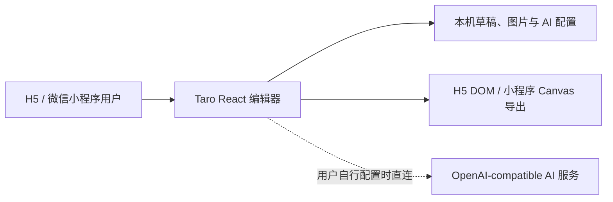

# 技术架构

## 1. 总览



应用是纯前端方案：编辑、草稿、媒体和导出均在设备本地完成，不包含项目自有 API、鉴权服务或服务端存储。AI 仅在用户主动保存本机配置后直接访问其指定的兼容服务。

## 2. Monorepo

仓库使用 pnpm workspace：

- `@wejizan/client`：Taro 4 + React 18 前端，同时输出 H5 和微信小程序。
- `@wejizan/contracts`：前端共享的 Zod schema 与 TypeScript 类型，是项目草稿模型的唯一事实来源。
- `@wejizan/editor-core`：无 UI 的随机内容、身份、评论、状态栏和项目生成逻辑。

根 `package.json` 负责聚合开发、类型检查、测试和构建。Node.js 版本范围为 24–26，包管理器固定为 pnpm 11.15.1。

## 3. 共享数据模型

`packages/contracts/src/index.ts` 使用 Zod 定义 `Identity`、`LocalImage`、`MomentPost`、`StatusBarScheme`、`ScreenshotOverlay` 与 `EditorProject`。当前 `schemaVersion` 为 1。

AI 响应 schema 同样在 contracts 中定义，用于在客户端校验上游返回内容；AI API 配置不属于项目草稿，单独存入本机存储，避免在导出或草稿分享时携带密钥。

## 4. 前端

### 4.1 入口与配置

- `apps/client/config/index.ts`：Taro Webpack 5 配置与 workspace 源码编译。
- `apps/client/src/index.html`：H5 HTML 模板。
- `apps/client/src/pages/editor/index.tsx`：编辑器状态、表单、AI 配置和导出编排。
- `apps/client/src/utils/api.ts`：用户配置的 OpenAI 兼容 API 直连与响应校验。
- `apps/client/src/utils/storage.ts`：本机草稿和 AI 配置存储。

Taro 默认只编译客户端 `sourceRoot`；共享 TypeScript 源码通过 `compile.include` 加入 H5/小程序编译，并强制使用 `babel.config.cjs`。Webpack 固定为 5.91.0。

### 4.2 本地媒体、草稿与 AI 配置

`utils/media.ts` 在 H5 将选择的 Blob 转为 data URL，在微信小程序保存临时文件。`utils/storage.ts` 把项目 JSON 及 AI 配置写入 Taro 同步 Storage。

AI 配置支持保存多套、切换活动配置、编辑、删除与连通性测试。每套配置含名称、Base URL、API Key 和模型名；它们只存在当前设备的本机存储，既不会写入 `EditorProject`，也不会经由本项目服务器传输。前端不能保护已经存储在浏览器或设备中的密钥，因此应仅在用户信任的设备上配置可控额度的密钥。

H5 直连要求 AI 上游允许 CORS。微信小程序直连要求将上游 HTTPS 域名添加到请求合法域名；这是一项部署者/用户配置，不可由前端绕过。

### 4.3 导出

- H5：隐藏的 `#capture-surface` 复用 DOM 朋友圈组件，通过 `html-to-image` 生成 3× PNG。
- 微信小程序：`capture-canvas` 使用 Canvas API 近似重绘当前视口并保存相册。

两端目前不是完全相同的渲染路径。小程序 Canvas 的长评论、复杂图片裁切、状态栏图标和布局细节需继续在真实设备/开发者工具中校准。

## 5. 构建与静态部署

```bash
pnpm build:h5
pnpm build:weapp
```

H5 产物为 `apps/client/dist`，可部署到任意支持 SPA history fallback 的静态托管服务。H5 与微信小程序构建共用该目录，不能并发执行；CI 会分别保存两份产物。

GitHub Actions 的 CI 执行类型检查、测试及两个前端构建，并上传 H5/小程序产物。

## 6. 测试现状

- `packages/editor-core/src/index.test.ts`：数量边界和项目生成相关核心测试。
- TypeScript 对 workspace 包执行 `tsc --noEmit`。
- 尚无客户端组件测试、端到端测试、截图视觉基线和微信开发者工具自动化。

H5 生产构建会给出非阻断体积提示；后续可通过更细的动态加载和依赖分析优化。

## 7. 技术不变量

1. 导出画面不得包含手机边框或编辑器辅助 UI。
2. 默认水印必须开启，关闭动作必须有用途确认。
3. AI Key 只能由用户在本机配置；不得在构建变量、项目草稿或代码中提供默认 Key。
4. AI 请求从客户端直接发送到用户指定的上游；不得恢复项目自有口令、短期令牌或调用限流服务。
5. H5 与微信小程序共享项目 schema 和核心数据生成逻辑。
6. 状态栏/叠加拖动必须跟手，拖动期间不得加入平滑延迟。
7. 任一平台专用能力必须有显式运行环境分支。
8. H5 与微信小程序构建不能并发写同一个 `dist`。
